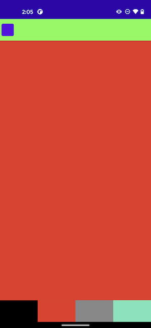

# NavLab

Small Android project demonstrating some navigation components for Jetpack Compose. Created this for presenting about this topic for a [GDG meetup](https://www.meetup.com/GDGOmaha/events/nsccpsyccmbsb/).

# The App

The consists of simple color screens. It implements bottom tab navigation, navigating within screens, a nav drawer and a modal sort of navigation that presents over the entire app.

## Color Screen

[Simple screen](./app/src/main/java/com/pv/navigationlab/screens/ColorScreen.kt) that is just the color of the rgb values passed.


```
@Composable
fun ColorScreen(color: Color) {
    Box(
        modifier = Modifier
            .fillMaxSize()
            .background(color)
    )
}
```

## Parent

Once launched, the ParentScreen is the top most composable container. It is simply a NavHost that returns the HomeScreen as its start destination. It also passes its navController down to the HomeScreen so if needed, a composable can be presented at a root level. In this app, the Drawer (discussed later) presents the Green and Pink screen in this form.


## Home Screen

The [HomeScreen](./app/src/main/java/com/pv/navigationlab/screens/HomeScreen.kt) handles the presentation of the home screen that includes the bottom nav items. There are 4 bottom nav items. The black and red screens are simple ColorScreens.




#### Choices

The [Color Choices screen](./app/src/main/java/com/pv/navigationlab/screens/ColorChoicesScreen.kt) presents a list of a few items that further navigate to a new ColorScreen.


#### Maker

The [Color Maker screen](./app/src/main/java/com/pv/navigationlab/screens/ColorMakerScreen.kt) allows you to create a custom RGB value and pushes a [Custom Color Screen](./app/src/main/java/com/pv/navigationlab/screens/ColorChoicesScreen.kt) passing those values via arguments.


#### Drawer

The [Drawer](./app/src/main/java/com/pv/navigationlab/screens/DrawerContent.kt) contains of a Pink and Green ColorScreen. Once clicked, these are presented via the navController from the Parent screen, and thus is able to present over the Home screen.


## Structure

Here is a diagram that shows the structure of the app too.


# Why does the nav button rotate when you're on the ColorMaker screen

Its because instead of creating another navController for this screen, I used the homeNavController purely for experimenting with the `currentBackStackEntryAsState`.

# todo

Will add more explaination around the varous navHosts and navControllers. Cleanup code too.